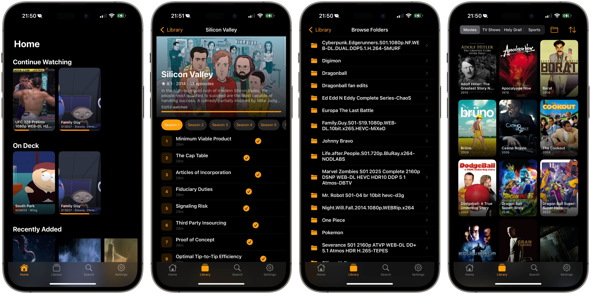

# Crucible

A personal Plex client for iOS, built entirely on Arch Linux.


No Xcode. No macOS. No storyboards. Pure programmatic UIKit, cross-compiled from Linux and deployed to iPhone over USB.



## Stack

| | Tool |
|---|---|
| Language | **Swift 6** with strict concurrency |
| UI | **UIKit** — programmatic, compositional layouts, diffable data sources, content configurations |
| Build | **SwiftPM** — cross-compiled with `swift build --swift-sdk arm64-apple-ios` |
| Deploy | **[xtool](https://github.com/xtool-org/xtool)** — cross-platform Xcode replacement, build and deploy iOS apps from Linux |
| Backend | **Plex Media Server API** — OAuth PIN auth, HLS transcoding, timeline reporting |
| Dev OS | **Arch Linux** (btw) |

## Features

- Plex OAuth sign-in with server discovery
- Home screen with Continue Watching, On Deck, and Recently Added hubs
- Library browsing with poster grid, genre filtering, and sort options
- Folder browsing for unindexed content with 3-column media grid
- Per-library Continue Watching carousels
- Movie and episode detail with backdrop hero, codec badges, subtitle/audio selection
- Show detail with season picker and episode list
- HLS transcoding via Plex universal transcoder
- Playback progress reporting via timeline API
- Quick play from context menus and poster overlays
- Search across all libraries
- Watch history
- Tailscale-first networking

## Building

Requires Swift 6+ via [swift-bin (AUR)](https://aur.archlinux.org/packages/swift-bin) and the iOS cross-compilation SDK.

```bash
swift build --swift-sdk arm64-apple-ios
```

## Deploying

Requires [xtool](https://github.com/xtool-org/xtool) and a USB-connected iPhone.

```bash
xtool dev run --usb
```

## Architecture

```
Sources/Crucible/
├── App/                    # AppDelegate, SceneDelegate, ServerBootstrap
├── Detail/                 # Movie/episode detail, show detail, episode cells
├── History/                # Watch activity history
├── Home/                   # Hub-based home screen
├── Library/                # Movie grid, show grid, folder browser
├── Networking/             # APIClient (actor), PlexEndpoints, PlexModels, ImageLoader
├── Player/                 # StreamResolver, PlaybackReporter, PlayerCoordinator
├── Search/                 # Search with hub-based results
├── Settings/               # Server info, sign out, Plex OAuth login
└── Shared/                 # Theme, PosterCell, ProgressBar, Formatters
```

Zero dependencies. Pure Foundation + UIKit + AVKit + WebKit + Security.
