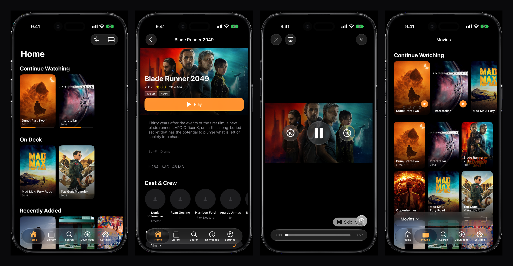

# Crucible

A fast, native Plex client for iPhone — offline downloads, Skip Intro, Picture-in-Picture, lock-screen controls, Handoff — built entirely on Arch Linux.


No Xcode. No macOS. No storyboards. Pure programmatic UIKit, cross-compiled from Linux and deployed to iPhone over USB.



## Stack

| | Tool |
|---|---|
| Language | **Swift 6** with strict concurrency |
| UI | **UIKit** — programmatic, compositional layouts, diffable data sources, content configurations, **Liquid Glass** on iOS 26 |
| Playback | **AVKit / AVFoundation** — direct play, HLS transcoding, offline file playback, Picture-in-Picture, lock-screen controls |
| Downloads | **Offline HLS engine** — background `URLSession` segment fetch, resumable, Wi-Fi-aware, **ActivityKit Live Activity** |
| Build | **SwiftPM** — cross-compiled with `swift build --swift-sdk arm64-apple-ios` |
| Deploy | **[xtool](https://github.com/xtool-org/xtool)** — cross-platform Xcode replacement, build and deploy iOS apps from Linux |
| Backend | **Plex Media Server API** — OAuth PIN auth, HLS transcoding, timeline reporting |
| Dev OS | **Arch Linux** |

## Features

### Playback

- **Direct play** for natively-supported codecs, automatic **HLS transcoding** otherwise
- **Skip Intro / Skip Credits** from Plex chapter markers
- **Picture-in-Picture** and **background audio**
- **Lock screen & Control Center controls** — play/pause, skip ±10s, scrub, next episode
- **Credits-triggered Up Next** autoplay between episodes
- **Skip Intro** your way: a glass button with a live progress sweep, automatic skipping with Undo, or off
- Adjustable **playback speed**, subtitle and audio track selection
- Resume from where you left off, progress synced to the server via the timeline API

### Offline downloads

A proper download engine — not the afterthought the official app ships.

- **Download movies, whole seasons, or single episodes** for offline viewing
- **Per-download quality** — Original (source quality), High (1080p · 20 Mbps), Medium (720p · 8 Mbps), Low (480p · 3 Mbps), and Data Saver (360p · 0.7 Mbps), with a configurable default in Settings
- **Live Activity** — a Lock Screen card and Dynamic Island showing live download progress (percent, current title, "X of Y"), built with **ActivityKit + a WidgetKit extension** — compiled and signed on Linux by xtool
- **Real offline HLS engine** — downloads the transcoded stream segment-by-segment into a self-contained local playlist, re-minting the Plex session on the fly so a stalled transcode never breaks the download
- **True background downloading** — segments are fetched over a **background `URLSession`**, so transfers continue in the system daemon while the app is suspended or terminated (the Live Activity keeps advancing); a fresh Plex session is re-minted on failure, downloads **auto-resume** from the segments already on disk, and a notification fires when one finishes while you're away
- **Real download queue** — concurrency limit plus pause / resume / cancel / retry per item and live progress
- **Wi-Fi-only by default** — downloads pause when you leave Wi-Fi and resume when it returns; opt into cellular with one toggle
- **Dedicated Downloads tab** — a storage summary, the live queue, and downloaded movies and shows grouped as stacks, with one-tap **Free up space** for watched titles
- **Season download sheet** — pick All, Unwatched or the Next 3 episodes, choose the quality, and optionally **keep the next episodes downloaded** as you watch
- **First-class offline playback** — Skip Intro / Skip Credits (markers saved with the download), resume, Picture-in-Picture, background audio, and lock-screen controls, all with no network
- **Storage management** — see space used, delete individual downloads or all at once, optional auto-delete of watched downloads; media is stored on-device and excluded from iCloud backup

### Browse & discover

- **Home** opens on a **Resume hero** for whatever you were watching, then Continue Watching, Up Next, a **This Week** watch-time card and Recently Added — and an **offline Home** built from your downloads when the server can't be reached
- **Library** poster grids (3-up by default, 2-up on request) with **filter chips** (All, Unwatched, In Progress, Genre, Sort), unwatched dots and counts, a compact Continue banner, an A–Z scrubber and the library switcher in the title menu; **folder browsing** for unindexed content
- **Movie and episode detail** with an immersive backdrop, one-tap Resume, audio and subtitle menus, quality badges, **Cast & Crew**, a details grid and **More Like This**
- **Show detail** with a season picker, episode rows that track watched and in-progress state, **swipe actions**, and a download ring on every episode
- **Search** on the system search tab: recents, genre tiles, and results grouped by type with a **Top Result**
- **You** tab: profile and live server status, a **Year in Review** card, **Watch History** grouped by day with posters, **Statistics**, Settings and **Server & Connection**
- **Statistics** — a Year-in-Review dashboard: watch time, streaks, activity heatmap, top shows and a shareable card, built from your Plex history
- **Handoff & Spotlight** — hand a title between devices, find recently-viewed media in iOS search
- **Surprise Me** random picker

### Built different

- **Liquid Glass** materials on iOS 26, with one design system underneath: tokens for colour, type, spacing and radii, one ember accent, and Light and Dark appearances
- **Accessible** — Dynamic Type everywhere, VoiceOver labels, Reduce Motion fallbacks, 44pt targets and contrast-checked colour pairs
- **Server & Connection** screen with per-route latency (Local, Tailscale, Relay), Prefer Local and Allow Relay switches, and add-by-address
- Automatic **best-connection server discovery** (prefers local, non-relay, HTTPS), Tailscale-friendly
- Live watched/progress refresh across Home, Library, and detail screens — never stale on return
- On-device **file logger** for diagnostics without a Mac attached, shareable from Settings
- Plex **OAuth** sign-in, token stored in the **Keychain**

## Building

Requires Swift 6+ via [swift-bin (AUR)](https://aur.archlinux.org/packages/swift-bin) and the iOS cross-compilation SDK.

```bash
swift build --swift-sdk arm64-apple-ios --build-system native
```

## Deploying

New to this? [INSTALL.md](INSTALL.md) walks through putting Crucible on your own iPhone, step by step.

Requires [xtool](https://github.com/xtool-org/xtool) and a USB-connected iPhone.

```bash
./scripts/install-ios.sh
```

The script checks your setup, builds a release configuration and installs it with `xtool dev run -c release --usb`. Run it with `--check` to verify without building.

## Marketing screenshots

The README and landing-page images are real captures of the app running in the iOS Simulator against a mock Plex server with generated, fictional artwork — no real library or copyrighted posters. `marketing/mock/` is the server and art generator, `marketing/shots/` drives the app and takes the screenshots (`run.sh`), and `compose.sh` frames them with the `frames` CLI (Apple device bezels) for the README banner and the gallery.

## Architecture

```
Sources/
├── CrucibleActivity/       # Shared ActivityAttributes (compiled into app + widget)
├── CrucibleWidgets/        # WidgetKit extension — download Live Activity (Lock Screen + Dynamic Island)
└── Crucible/               # The app
    ├── App/                # AppDelegate, SceneDelegate, ServerBootstrap, BGTask registration, deep links
    ├── Detail/             # Movie/episode detail, show detail, cast & episode cells
    ├── Downloads/          # HLS download engine, store, resolver, Live Activity controller, offline UI + tab
    ├── History/            # Watch History (day-grouped, filterable)
    ├── Home/               # Resume hero, rails, This Week card, offline Home
    ├── Library/            # Shared poster grid, filter chips, A–Z scrubber, folder browser
    ├── Networking/         # APIClient (actor), endpoints, models, ImageLoader, Keychain, blurhash
    ├── Player/             # StreamResolver, PlaybackReporter, PlayerCoordinator, Now Playing, Up Next
    ├── Search/             # Search tab: recents, genre browse, grouped results
    ├── Settings/           # Settings, Server & Connection, sign-in and server setup
    ├── Shared/             # Theme tokens, Glass, poster/landscape cards, chips, buttons, haptics, AppLogger
    ├── Stats/              # GRDB-backed statistics: sync, store, charts, Year in Review
    └── You/                # Profile hub, year card, about
```

The widget extension is built and signed entirely on Linux via xtool's `extensions:` mechanism — Live Activities with no Xcode.

One third-party dependency, [GRDB](https://github.com/groue/GRDB.swift), for the statistics store. Everything else is Apple frameworks: Foundation, UIKit, AVKit/AVFoundation, MediaPlayer, Network, BackgroundTasks, ActivityKit, WidgetKit, UserNotifications, CoreSpotlight, WebKit, Security.
